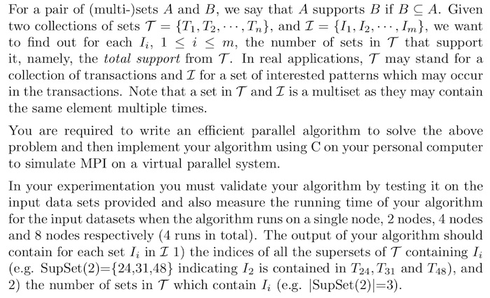

# SupSet

An assignment for **Distributed Computing**.

## Problem Description



## Usage

```
make run
```

## Result

```
SupSet(0) = {24, 31, 48}
|SupSet(0)| = 3
SupSet(1) = {1, 26, 29, 31, 36, 45, 55}
|SupSet(1)| = 7
SupSet(2) = {3, 10, 12, 51}
|SupSet(2)| = 4
SupSet(3) = {35, 37, 40, 45}
|SupSet(3)| = 4
SupSet(4) = {31, 44, 58}
|SupSet(4)| = 3
SupSet(5) = {1, 31, 38}
|SupSet(5)| = 3
SupSet(6) = {2, 9, 26, 28, 46}
|SupSet(6)| = 5
SupSet(7) = {}
|SupSet(7)| = 0
```